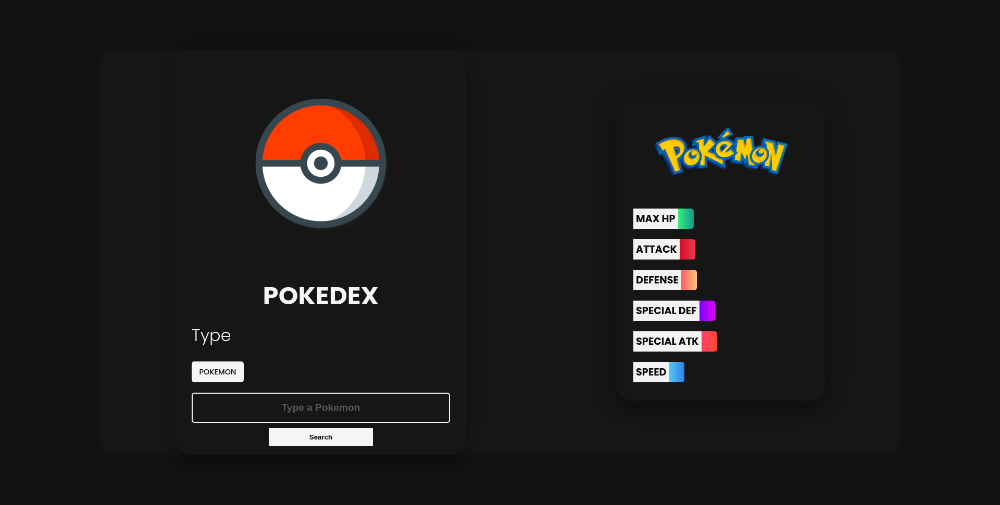
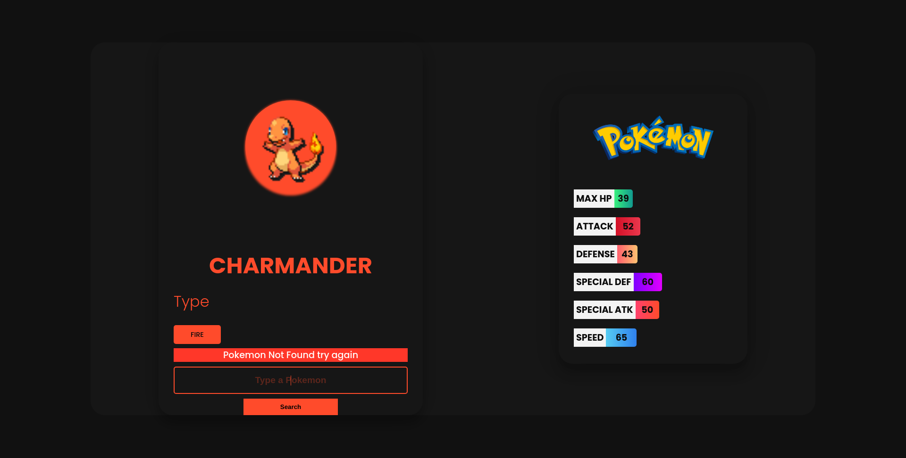
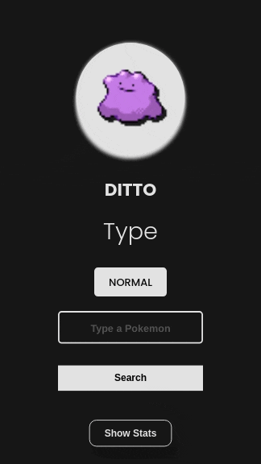
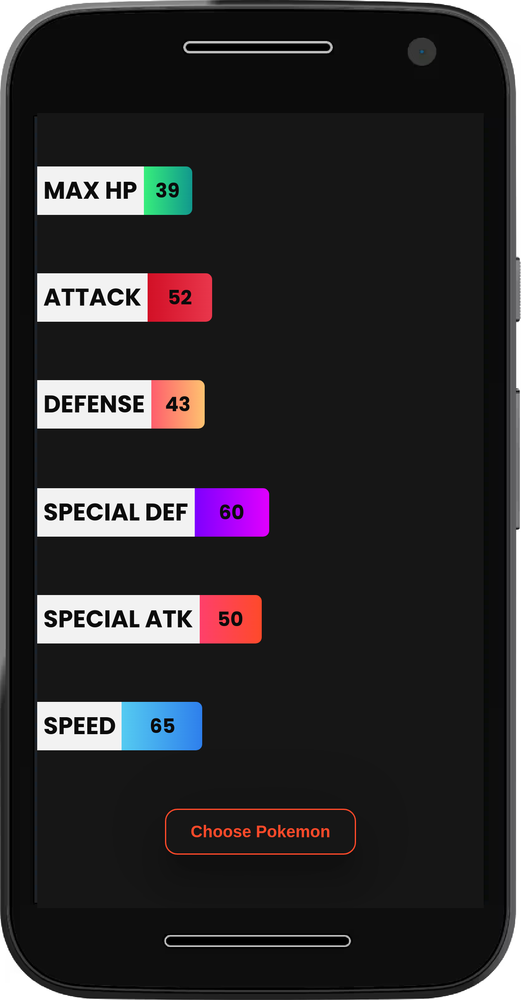

# Pokedex

Uma pokedex traz além do pokemon suas estatísticas
Projeto foi feito para aprendizado do consumo de uma API e animações

## Tela Inicial Web

## Tela Inicial Mobile

O site está hospedado na vercel e você pode acessa-lo por este link https://web-pokedex.vercel.app/

## Stack utilizada

**Front-end:** Vanilla Javascript, Css e HTML5

**Misc:** Gulp, Babel, ESlint e Conventional Commits

## Aprendizados

- Busquei ter total atenção a tags semânticas
- Boas práticas de código
- Fetch e Promises para consumo da API
- Animações de entrada e saida de telas
- ESlint para manter um padrão de código
- Conventional Commits para facilitar a leitura de commits
- Responsividade

## Como usar

Após digitar o número do pokemon ou seu nome é só clicar em search

## NOT FOUND

Caso o pokemon não exista ou aconteça algum erro de digitação uma tela irá avisar sobre.

### Mobile

Na versão mobile ao clicar no botão Show Stats a tela de estatísticas do pokemon aparece

### Animações

Além das animações de entrada e saida de tela temos também animações nos pokemons e na imagem pokemon acima da tela
de estatísticas.

## Funcionalidades

- Busca de Pokemons por nome ou número na pokedex
- Possui responsividade
- Animações no mobile e desktop
- Mudança de cores de acordo com o Pokemon buscado
- Salva o tempo registrado no cronômetro
